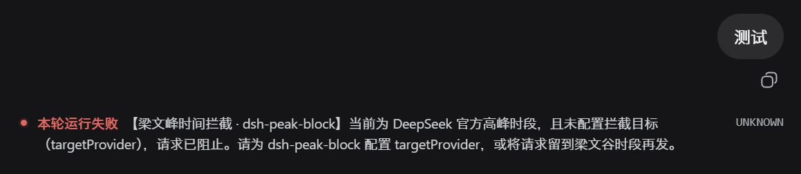

# dsh·禁止梁文峰

在 DeepSeek 官方高峰时段拦截官方 provider 请求，保障安心使用梁文谷。

高峰时段默认北京时间工作日 09:00–12:00、14:00–18:00，周末全天谷价。拦截到官方请求时：已配置 `targetProvider` 则切到该目标，未配置则阻止并提示；非高峰不拦截，正常走官方。官方判定默认只精确匹配 `deepseek-official`，不做名称前缀规则，因此 pi-ai 自带的三方 `deepseek` 中转不会误拦。

## 效果

未配置 `targetProvider` 时于高峰时段发起官方请求，请求被阻止，界面呈现「未配置拦截目标」的报错：



## 演示视频

| 禁止梁文峰演示 · 24 秒 |
| :---: |
| [](https://www.bilibili.com/video/BV1zvth6oEFp/) |

## 安装

**从 GitHub 安装**：源码在 `src/`，`lib/` 不入仓库，安装时 npm 会触发 `prepare` 脚本现场构建。

```powershell
dsh plugin --profile web add github:better-er/dsh-peak-block
```

**从 npm 安装**：包内已含构建产物 `lib/index.js`，安装时不再构建。

```powershell
dsh plugin --profile web add dsh-peak-block
```

两种方式装完都会自动挂载，重启 DSH web 后启用，无需手工编辑任何文件。

## 卸载

```powershell
dsh plugin --profile web remove dsh-peak-block
```

彻底移除，重启 DSH web 后不再加载。

## 配置

插件通过 cordis 配置注入，默认 `enabled: true`，其余键可覆盖：

| 键 | 默认 | 说明 |
|---|---|---|
| `enabled` | `true` | 总开关 |
| `officialProviders` | 未设，只认 `deepseek-official` | 视为「官方」的 provider 精确名单，不设用默认判定 |
| `targetProvider` | 空 | 拦截后切到的目标 provider；留空 = 阻止并提示 |
| `peakWindow` | 工作日 9–12、14–18，周末谷 | 峰谷时段窗口，可整体或局部覆盖 |

配置示例：

```yaml
plugins:
  dsh-peak-block:
    enabled: true
    targetProvider: opencode-go
    peakWindow:
      days: [1, 2, 3, 4, 5]
      hourRanges: [[9, 12], [14, 18]]
      weekendOffPeak: true
```

## 边界

- 只拦对话模型请求：`agent/request` 覆盖 agent loop 的正常对话；compaction 等走 `ctx.llm.stream` 的路径不拦。
- `targetProvider` 必须是 DSH 已注册适配器路由，否则切换后以 `NO_ADAPTER` 失败。
- `days` 用 JS `getUTCDay` 序号，1..5 为周一..周五；时区判定纯 UTC+8 数学换算，与系统时区无关。

## 要求与开发

- 是**标准形态的 dsh host 单半身插件**：host 在 `agent/request` waterfall 里拦截并切换/阻止，设置全部经 cordis 配置文件注入，见上方配置表，不提供界面配置 UI。
- TypeScript 源码在 `src/index.ts`，由 tsdown 构建到 `lib/`；`lib/` 是产物不入库，改完要重新构建：

  ```powershell
  pnpm install
  pnpm build        # 构建 lib/index.js 与 lib/index.d.ts
  pnpm typecheck    # 严格类型检查
  pnpm test         # vitest 单测，覆盖峰谷判定与拦截决策
  ```

- 纯函数 `isPeakBeijing` / `isOfficial` / `decide` 从包入口导出，单测见 `tests/index.spec.ts`。

## License

[MIT](./LICENSE)
